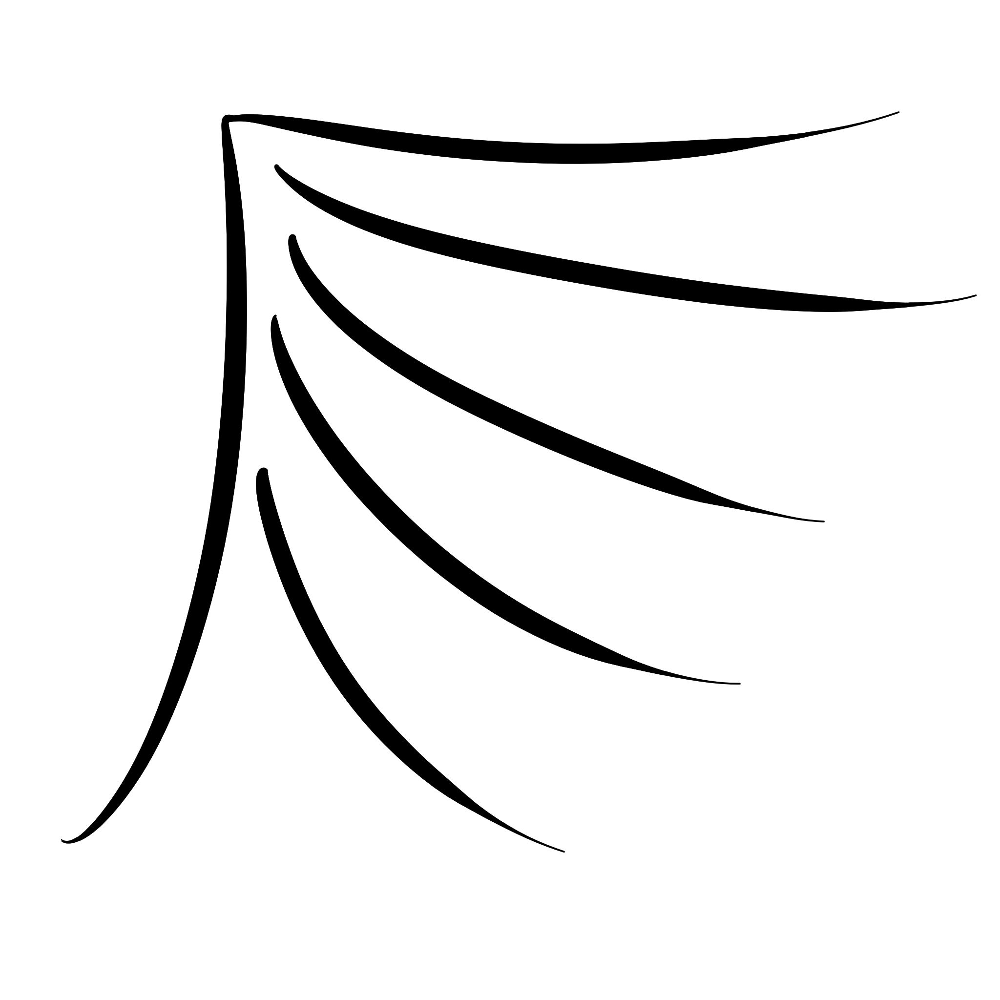

 

  
<h2 align="center">Angel Game Engine</h3>

  
Table of Contents

  <ol>
    <li>
      <a href="#about-the-project">About The Project</a>
      <ul>
        <li><a href="#design-philosophy">Design Philosophy</a></li>
      </ul>
    </li>
    <li><a href="#prerequisites">Prerequisites</a></li>
    <li><a href="#license">License</a></li>
  </ol>

 

[![c++ 17][cpp_icon]](#)\
[![Vulkan 1.4][vulkan_icon]](https://vulkan.org/)

## About The Project
**This project is simply just a hobby project. It is mainly a learning tool for myself. It currently does not have enough to be practically usable.**

Angel game engine is a hobby 3D game engine/framework project. The engine will be written from scratch, to the best of my ability, with minimal external dependencies. See [Design Philosophy](#design-philosophy) for more details about this. 

The engine uses c++ and Vulkan 1.4 as the graphics API.

See [Prerequisites](#prerequisites) for more info including operating system support.

### Design Philosophy
It is important to note that this project is mainly a learning tool for myself. As a result, many design decisions are aimed at achieving this goal, rather than for the purpos of production.

This project will attempt to minimize external dependencies/prerequisites as much as possible. As a result, some items from STL will have a custom implementation. The only foreseeable external dependency that may be included are scripts related to parsing file formats.
## Prerequisites

- Windows or Linux Wayland (MacOS is currently not supported, nor is X11)
- Vulkan 1.4
- c++17 (although, this will likely increase to c++20)

## License
[MIT](LICENSE.txt)

[vulkan_icon]: https://img.shields.io/badge/Vulkan-AE0F28?logo=Vulkan&logoColor=fff
[cpp_icon]: https://img.shields.io/badge/C++-%2300599C.svg?logo=c%2B%2B&logoColor=white
